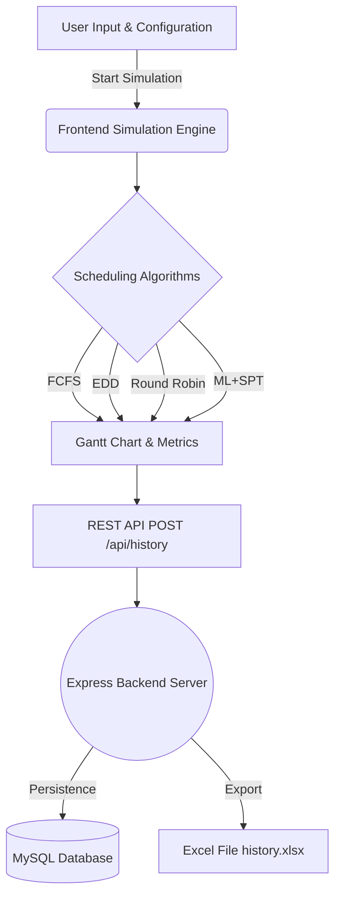

  <h1>🏭 IPSS: Intelligent Production Scheduling System</h1>
  
<em>AI-Powered Industry 4.0 Smart Factory Optimization</em>

  <!-- Badges -->
  
  
  
  

---

## 📖 Overview

The **Intelligent Production Scheduling System (IPSS)** focuses on applying Artificial Intelligence, Machine Learning, and Discrete-Event Simulation techniques to optimize job scheduling on an industrial factory floor. 

It evaluates four scheduling algorithms:
- **FCFS** (First Come, First Served)
- **EDD** (Earliest Due Date)
- **Round Robin**
- **ML+SPT** (Machine Learning + Shortest Processing Time) 🌟 *AI-Powered*

The AI-powered **ML+SPT** algorithm uses a Random Forest model to predict job processing times and minimize wait time. The system simulates real-world disruptions (machine breakdowns, material shortages, and power outages) to align with **Industry 4.0** resilience practices.

---

## 🏗 System Architecture & Flow

IPSS is designed as a modular Full-Stack application ensuring performance and scalability.

> [!NOTE]  
> **Data Flow Strategy:** The frontend handles intense multi-algorithm simulations concurrently. Only the finalized optimal payload is POSTed to the backend to conserve network bandwidth.

---

## 📂 Project Structure

<b>🛠️ Backend Architecture</b>

| File | Description |
|------|-------------|
| ⚙️ `backend/server.js` | Express server entry point. Serves static files and API. |
| 🗄️ `backend/db.js` | MySQL connection handler. Manages `app_history` schema. |
| 🛣️ `backend/routes.js` | RESTful API endpoints for frontend communication. |
| 📊 `backend/excel.js` | Automated Excel history export generation using `exceljs`. |
| 🔒 `.env` | Secure environment variable storage (Credentials & Port). |

<b>🎨 Frontend Architecture</b>

| Directory / File | Description |
|-----------------|-------------|
| 🌐 `frontend/index.html` | Structural core of the UI (Semantic HTML5, Chart.js). |
| 💅 `frontend/css/` | Modular styling: `variables.css` (Neon Lime Theme), `layout.css`, `components.css`. |
| 🧠 `frontend/js/` | Modular Logic: `simulation.js`, `math.js`, `api.js`, `render.js`. |

---

## 🚀 Setup & Installation

> [!IMPORTANT]  
> Before you begin, ensure you have **Node.js (v18+)** and **MySQL Community Server** installed and running locally.

For full, step-by-step instructions on running the environment, please refer to the dedicated **[RUN_GUIDE.md](./RUN_GUIDE.md)**!

---

## 📈 Scheduling Algorithms Evaluated

| Algorithm | Strategy | Pros | Cons |
|:---------:|:---------|:-----|:-----|
| **FCFS** | Processes jobs in exact order of arrival. | Simple to implement, strictly fair. | Susceptible to the "Convoy Effect" (long delays). |
| **EDD** | Sorts by deadline timestamp & priority. | Ensures SLA compliance natively. | Ignores processing duration efficiency. |
| **RR** | Cycles through jobs uniformly. | Even wear-and-tear across machines. | Increases total average wait time. |
| **ML+SPT** | **Predicts duration & sorts shortest first.** | Lean queues, highest throughput. | Requires ML training data / overhead. |

> [!TIP]  
> **Why ML+SPT?** By predicting exact processing times based on job weight and machine complexity, ML+SPT avoids choke-points entirely, often yielding >40% time savings in heavily loaded environments.
