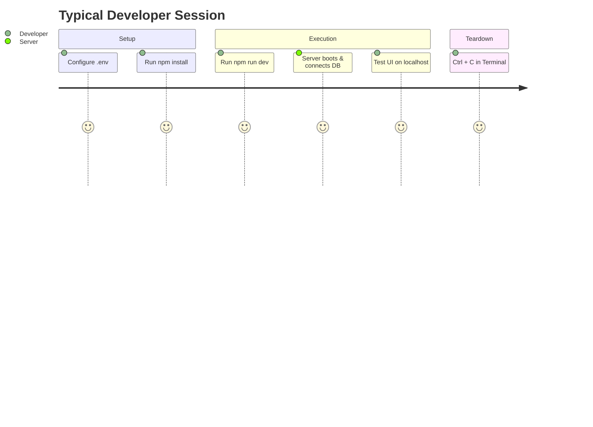

<div align="center">
  <h1>⚡ IPSS: Developer Run Guide</h1>
  <p><em>Your quick-start manual for launching the Full-Stack Environment</em></p>
</div>

> [!WARNING]  
> **Do not use a generic "HTML Live Server" plugin!**  
> This application requires the Express.js backend to be running in order to handle REST API calls and Database persistence.

---

## 🛠️ Step-by-Step Launch Sequence

### 1️⃣ Open your Terminal
Open your terminal inside your IDE (e.g., VS Code). Make sure your current working directory is the project root:
```bash
cd "path/to/IPSS"
```

### 2️⃣ Configure Environment Variables
Create or verify your `.env` file in the root directory to connect the backend to your local MySQL instance:
```env
DB_HOST=localhost
DB_USER=root
DB_PASSWORD=your_actual_password_here
DB_NAME=ipss
PORT=3000
```
> [!NOTE]  
> If the database connection fails (e.g., wrong password or MySQL is offline), the application will **gracefully degrade** and run without persistence. You can still test and use the frontend simulation UI!

### 3️⃣ Install Dependencies
Pull down all necessary Node modules required by `package.json`:
```bash
npm install
```

### 4️⃣ Ignite the Development Server
Launch the Node.js backend. We use the `dev` script which enables **hot-reloading** for backend files via `node --watch`.
```bash
npm run dev
```

### 5️⃣ Access the Dashboard
Once you see the following success message in your terminal:
```text
🚀 IPSS server running → http://localhost:3000
```
Open your favorite web browser and navigate to:
👉 **[http://localhost:3000](http://localhost:3000)**

---

## 🛑 How to Stop the Server
When you are finished testing, gracefully shut down the local server:
1. Click into the terminal window.
2. Press <kbd>Ctrl</kbd> + <kbd>C</kbd>.
3. If prompted by Windows to *Terminate batch job?*, type <kbd>Y</kbd> and press <kbd>Enter</kbd>.

---

## 🗺️ Developer Flow Summary


